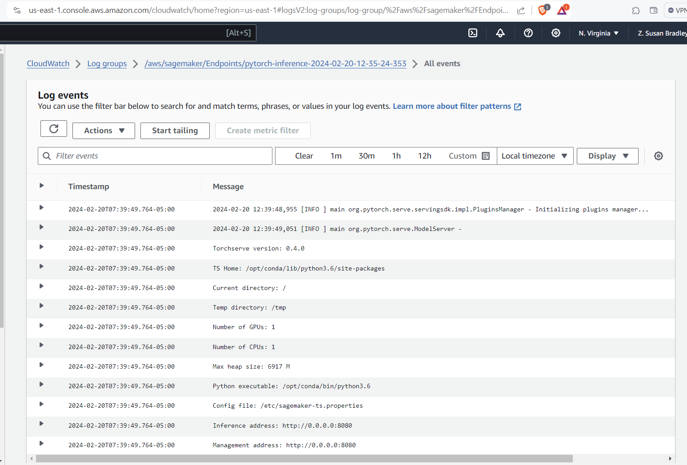

# Image Classification using AWS SageMaker

Use AWS Sagemaker to train a pretrained model that can perform image classification by using the Sagemaker profiling, debugger, hyperparameter tuning and other good ML engineering practices. This can be done on either the provided dog breed classication data set or one of your choice.

Write code to use Sagemaker to finetune a pretrained model with hyperparameter tuning. Once you have found the best hyperparameters, you can use them to train an estimator with model debugging and profiling. This model will then need to be deployed and tested.

## Project Set Up and Installation
Enter AWS through the gateway in the course and open SageMaker Studio. 
Download the starter files.
Download/Make the dataset available. 

## Dataset
The provided dataset is the dogbreed classification dataset which can be found in the classroom.
The project is designed to be dataset independent so if there is a dataset that is more interesting or relevant to your work, you are welcome to use it to complete the project.

### Access
Upload the data to an S3 bucket through the AWS Gateway so that SageMaker has access to the data. 

## Hyperparameter Tuning
What kind of model did you choose for this experiment and why? Give an overview of the types of parameters and their ranges used for the hyperparameter search

Remember that your README should:
- Include a screenshot of completed training jobs
- Logs metrics during the training process
- Tune at least two hyperparameters
- Retrieve the best best hyperparameters from all your training jobs


### Why GPU instance?
GPUs (Graphics Processing Units) are well-suited to deep learning for several reasons. 
- deep learning involves performing many parallel computations, and GPUs are designed to handle parallel processing efficiently, making them ideal for tasks like matrix multiplication and neural network operations
- GPUs have a large number of cores, which allows them to handle multiple calculations simultaneously, speeding up the training and inference processes in deep learning. 
- GPUs are optimized for handling large amounts of data, which is essential in deep learning tasks that involve processing and analyzing massive datasets. 
- Overall, the parallel processing power, large number of cores, and data-handling capabilities of GPUs make them well-suited for accelerating deep learning tasks.


https://pages.awscloud.com/rs/112-TZM-766/images/AL-ML%20for%20Startups%20-%20Select%20the%20Right%20ML%20Instance.pdf

https://sagemaker.readthedocs.io/en/stable/frameworks/pytorch/using_pytorch.html#serve-a-pytorch-model


2024-02-20 12:07:53 Starting - Preparing the instances for training
2024-02-20 12:07:53 Downloading - Downloading the training image
2024-02-20 12:07:53 Training - Training image download completed. Training in progress.
2024-02-20 12:07:53 Uploading - Uploading generated training model
2024-02-20 12:07:53 Completed - Resource retained for reuse
{'_tuning_objective_metric': '"average test loss"',

```python
 'batch_size': '"64"',
 'epochs': '"3"',
 'lr': '0.013836913247884417'
```


 'sagemaker_container_log_level': '20',
 'sagemaker_estimator_class_name': '"PyTorch"',
 'sagemaker_estimator_module': '"sagemaker.pytorch.estimator"',
 'sagemaker_job_name': '"pytorch-training-2024-02-20-12-00-40-627"',
 'sagemaker_program': '"hpo.py"',
 'sagemaker_region': '"us-east-1"',
 'sagemaker_submit_directory': '"s3://sagemaker-us-east-1-477120104741/pytorch-training-2024-02-20-12-00-40-627/source/sourcedir.tar.gz"'}

## Debugging and Profiling

Sagemaker debugger library ``` sagemaker.debugger ``` includes functionality for debugging the profiling. The profile generated in the notebook contains the profiler report.


### Results

Because the resnet18 model was trainined with small hyperparameters due to cost the profiling/debugging did not yield many insights.

n two probability distributions for a given random variable or set of events.


## Model Deployment
**TODO**: Give an overview of the deployed model and instructions on how to query the endpoint with a sample input.


Given that the pretrainned resnet18 model was fairly basic, it's performance is acceptable. On Epoch 2 the Loss was 0.8946 and the Accuracy 82.08%.


The endpoint was deployed using the "ml.g4dn.2xlarge" instance with the inference script.


**TODO** Remember to provide a screenshot of the deployed active endpoint in Sagemaker.
JOB 1 (the best model):


https://youtu.be/Md4b67HvmRo

## Standout Suggestions
**TODO (Optional):** This is where you can provide information about any standout suggestions that you have attempted.


## Standout Suggestions
Here are some of the suggestions to improve your project:


Package Your Model: Can you package your model as a Docker Container so that it can be easily deployed
Multi-Model Endpoint: Can you finetune multiple (different) pretrained models and try to deploy them to the same endpoint in the form of a Multi-Model Endpoint?
Batch Transform: Can you create a batch transform that performs inference on the whole test set together?
Model Explainability: Can you use Amazon Sagemaker Clarity to make your models more interpretable?

## Directions


### In AWS open SageMake Studio Classic

### Run space

%%bash
tar -czf dogImages.tar.gz dogImages

I understand your situation and I experienced the same thing before. Please note that you won't need to re-download it to your sagemaker workspace once you finished the upload.

Try NOT to explore the data files using the UI, it will make everything slow.
Delete the dataset in your workspace once you have a copy on your s3 bucket.

s3://sagemaker-us-east-1-631507419627/dog-image-data


Data Channels: the notebook parameters can be passed to your script using environment variables

## Thoughts

Although this is not explained, or even mentioned, on the "Step 2: Train the Model" page, in train_and_deploy.ipynb it has us training a first model using hpo.py, and then using the best parameters to train a second model using train_model.py.

It looks like we could (if not for the project's requirements) just use tuner.best_estimator() from the first model that was trained using hyperparameter tuning, and not need to train the second model with best_estimator.hyperparameters(), is that correct?
Is the purpose of training a second model, using train_model.py and best_estimator.hyperparameters() from the first training, so that we can apply model debugging and profiling to the second model training?
I'm presuming that we would not want to debug/profile when using hyperparameter tuning, as we would not want to see all of that, from every combination it tried, is that why we're doing it this way?

## Resources

https://knowledge.udacity.com/questions/766656